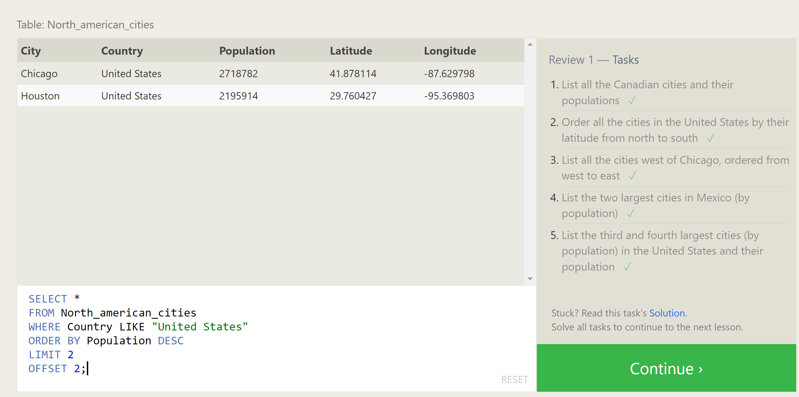

# SQL Tutorial

## Summary of What I Learned:
After completing the exercises shown below,
I learned how SQL is a language that can filter through databases that look similar to that of an excel sheet. As the exercises progressed, the more complicated the filtering became.

